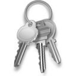

SSH Keys
======================================================================

What is SSH?
----------------------------------------------------------------------
SSH, "Secure Shell," or "Secure Socket Shell" is an interface for UNIX based systems which allows for secure remote access to computers. SSH transfers are encrypted and secured using "ssh keys" and digital certificates.

Sources: 
	- http://searchsecurity.techtarget.com/definition/Secure-Shell
	- http://en.wikipedia.org/wiki/Secure_Shell

SSH keys
----------------------------------------------------------------------
One method of identifying and authorizing a connection to an SSH server involves the use of SSH keys. This method is known as public-key cryptography. Public-key cryptography using SSH keys is a convenience for developers interested in connecting to machines remotely securely and without password authentication.

How they work...
^^^^^^^^^^^^^^^^^^^^^^^^^^^^^^^^^^^^^^^^^^^^^^^^^^^^^^^^^^^^^^^^^^^^^^
When seeking to connect to a system via SSH, one must generate an SSH-key pair: a private and public key. The private key is maintained on the local machine while the public key is shared with the machine to be connected with. 

When a user with a public/private key pair requests a connection, the server sends "a challenge." This challenge is decoded locally on the user's machine using the private key. Any information sent across the network is encrypted using the public key.

This process occurs behind the scenes: the user should not have to be more involved than requesting a connection to the server.

Sources:
	- https://wiki.archlinux.org/index.php/SSH_Keys
	
Obtaining a key
^^^^^^^^^^^^^^^^^^^^^^^^^^^^^^^^^^^^^^^^^^^^^^^^^^^^^^^^^^^^^^^^^^^^^^

To generate the public/private key pair, enter the following command in your local Linux/Unix machine:

	::
	ssh-keygen -t rsa

The command will ask you where to save your keys. The default is USER_HOME/.ssh

The next prompt is for a passphrase. This passphrase is used to unlock the private key locally - the private key, nor the password, is never sent over the network.

A private key, public key, and authorized_users files should be present in your ~/.ssh directory once you generate an ssh key pair as mentioned above. The server will automatically challenge the private key in this location when the request to connect is sent.

Copying the public key to the remote server is the final step. Some servers have this information input online (GitHub, FutureGrid). Otherwise, the contents of the newly generated public key, stored within id_rsa.pub, should be copied into the authorized_keys file within the remote machine (usually located at ~/.ssh/authorized_keys").

Sources:
.. _Digital Ocean: https://www.digitalocean.com/community/tutorials/how-to-set-up-ssh-keys--2

(image: http://en.clipart-fr.com/data/icons/set_04/icones_01776.png)
